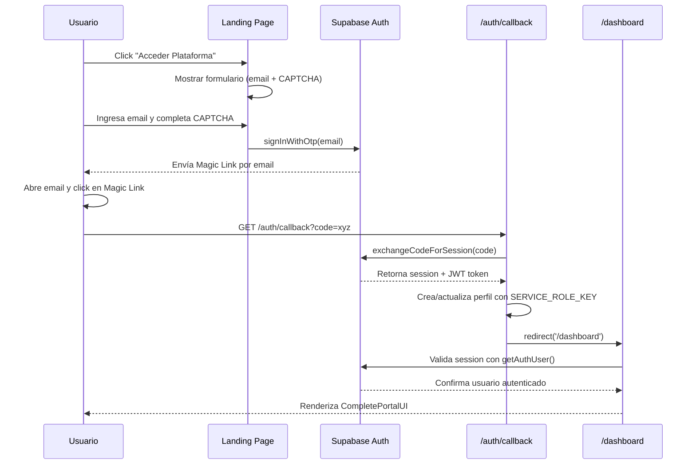

# 🔒 TarantulaHawk - Security Checklist

## ✅ Implementaciones de Seguridad Completadas

### 1. **Magic Link Authentication**
- ✅ Enlaces de un solo uso (no reutilizables)
- ✅ Expiración automática: 60 minutos
- ✅ Validación de código en servidor (no cliente)
- ✅ Redirect automático a `/dashboard` después de autenticación
- ✅ Sin pantalla intermedia (previene phishing de redirección)

### 2. **Server-Side Authentication**
- ✅ `createServerClient` con cookies seguras
- ✅ `SERVICE_ROLE_KEY` solo en servidor (nunca en cliente)
- ✅ Tokens JWT verificados por Supabase
- ✅ Sesiones persistentes con cookies HttpOnly

### 3. **Route Protection (Middleware)**
- ✅ `/dashboard/*` - Requiere autenticación
- ✅ `/admin/*` - Requiere autenticación + role='admin'
- ✅ `/api/credits/*` - Requiere autenticación
- ✅ `/api/paypal/*` - Requiere autenticación
- ✅ Redirect automático a `/` si no autenticado

### 4. **Row Level Security (RLS)**
- ✅ `profiles` - Usuario solo ve su propio perfil
- ✅ `transaction_history` - Usuario solo ve sus transacciones
- ✅ `auditor_client_access` - Auditor solo ve clientes asignados
- ✅ `api_keys` - Usuario solo ve sus propias API keys
- ✅ `api_key_usage` - Usuario solo ve su propio usage
- ✅ `audit_logs` - Logs protegidos (solo servicio)

### 5. **Credit System Security**
- ✅ Funciones `deduct_credits` y `add_credits` con `SECURITY DEFINER`
- ✅ Transacciones atómicas con `FOR UPDATE` lock
- ✅ Separación: `credits_gifted` vs `credits_purchased`
- ✅ Validación de saldo antes de deducción
- ✅ Registro inmutable en `transaction_history`

### 6. **Admin Protection**
- ✅ Middleware valida `role='admin'` antes de acceso
- ✅ RLS función `is_admin()` para políticas de base de datos
- ✅ Service role key requerida para operaciones admin
- ✅ Auditor solo ve clientes asignados (no todos)

### 7. **Rate Limiting**
- ✅ Redis (Upstash) para control de tráfico
- ✅ Tiers: free (10/hr), paid (100/hr), enterprise (10k/hr)
- ✅ Fallback a DB si Redis no disponible
- ✅ Headers estándar: X-RateLimit-Limit, Remaining, Reset

---

## 🔐 Configuración Requerida en Supabase

### Variables de Entorno (`.env.local`)
```bash
# Supabase
NEXT_PUBLIC_SUPABASE_URL=https://your-project.supabase.co
NEXT_PUBLIC_SUPABASE_ANON_KEY=eyJhbG...
SUPABASE_SERVICE_ROLE_KEY=eyJhbG... # ⚠️ NUNCA EXPONER EN CLIENTE

# Upstash Redis (Rate Limiting)
UPSTASH_REDIS_REST_URL=https://...
UPSTASH_REDIS_REST_TOKEN=...

# Cloudflare Turnstile (CAPTCHA)
NEXT_PUBLIC_TURNSTILE_SITE_KEY=0x4AAA...
TURNSTILE_SECRET_KEY=0x4AAA...
```

### Configuración de Email (Supabase Dashboard)
1. **Authentication → Email Templates**
   - Magic Link template: Configurar redirect a `/auth/callback`
   - Subject: "Tu enlace de acceso seguro a TarantulaHawk"

2. **Authentication → Settings**
   - ✅ Enable Email OTP
   - ✅ Disable Email Confirmation (usamos Magic Link)
   - ✅ Mailer: SMTP o SendGrid configurado
   - Token expiry: 3600 segundos (60 minutos)

3. **Authentication → URL Configuration**
   - Site URL: `https://yourdomain.com`
   - Redirect URLs:
     - `http://localhost:3000/auth/callback` (dev)
     - `https://yourdomain.com/auth/callback` (prod)

---

## ⚠️ Validaciones de Seguridad Necesarias

### En Supabase SQL Editor - Ejecutar estas queries:

#### 1. Verificar RLS está activo:
```sql
SELECT schemaname, tablename, rowsecurity 
FROM pg_tables 
WHERE schemaname = 'public' 
AND tablename IN ('profiles', 'transaction_history', 'auditor_client_access', 'api_keys');
```
**Esperado**: Todas deben tener `rowsecurity = true`

#### 2. Verificar políticas RLS existen:
```sql
SELECT schemaname, tablename, policyname, cmd 
FROM pg_policies 
WHERE schemaname = 'public';
```
**Esperado**: Mínimo 10 políticas (SELECT, INSERT, UPDATE para cada tabla)

#### 3. Verificar funciones de seguridad:
```sql
SELECT proname, prosecdef 
FROM pg_proc 
WHERE proname IN ('deduct_credits', 'add_credits', 'is_admin');
```
**Esperado**: Todas deben tener `prosecdef = true` (SECURITY DEFINER)

#### 4. Test de aislamiento de usuarios:
```sql
-- Como usuario regular (no admin)
SELECT * FROM profiles WHERE id != auth.uid();
```
**Esperado**: 0 rows (no puede ver otros perfiles)

#### 5. Test de función admin:
```sql
-- Reemplazar con tu user_id de admin
SELECT is_admin('tu-user-id-aqui');
```
**Esperado**: `true` para admin, `false` para otros

---

## 🛡️ Vectores de Ataque Prevenidos

### ❌ Intentos de Hackeo Bloqueados:

1. **SQL Injection**: 
   - ✅ Supabase usa prepared statements
   - ✅ RLS valida permisos en DB

2. **Session Hijacking**:
   - ✅ Tokens JWT firmados y verificados
   - ✅ Cookies HttpOnly (no accesibles por JS)
   - ✅ Expiración automática de sesiones

3. **Acceso Directo a Rutas Privadas**:
   - ✅ Middleware valida autenticación antes de renderizar
   - ✅ Server Components validan en servidor (no cliente)
   - ✅ Redirect automático si no autenticado

4. **Manipulación de Créditos**:
   - ✅ Funciones SECURITY DEFINER (usuario no puede llamarlas directamente)
   - ✅ Transacciones atómicas con locks
   - ✅ Validación de saldo antes de deducir

5. **Escalación de Privilegios**:
   - ✅ Middleware valida role='admin' en `/admin`
   - ✅ RLS previene que 'client' vea datos de otros
   - ✅ Auditor solo ve clientes asignados en `auditor_client_access`

6. **Replay Attacks (Magic Link)**:
   - ✅ Código de un solo uso (Supabase invalida después de exchange)
   - ✅ Expiración de 60 minutos
   - ✅ Bound al email específico

7. **Rate Limit Bypass**:
   - ✅ IP-based limiting (no user-agent)
   - ✅ Redis persistence (no in-memory)
   - ✅ Fallback a DB si Redis falla

8. **CSRF (Cross-Site Request Forgery)**:
   - ✅ SameSite cookies
   - ✅ Origin validation en API routes
   - ✅ Supabase auth tokens en headers

---

## 🚨 Acciones Requeridas ANTES de Producción

### 1. Supabase Dashboard
- [ ] Verificar RLS activo en todas las tablas (query arriba)
- [ ] Configurar SMTP para emails (no usar Supabase default en prod)
- [ ] Agregar dominios de producción a Redirect URLs
- [ ] Habilitar Audit Logs en Supabase (para compliance)

### 2. Ambiente de Producción
- [ ] Rotar `SERVICE_ROLE_KEY` (generar nueva en Supabase)
- [ ] Configurar SSL/TLS (Vercel lo hace automático)
- [ ] Habilitar CORS solo para dominios confiables
- [ ] Configurar monitoring (Sentry, LogRocket)

### 3. Testing de Seguridad
- [ ] Intentar acceder `/dashboard` sin login (debe redirigir)
- [ ] Intentar acceder `/admin` como usuario regular (debe redirigir)
- [ ] Intentar deducir créditos directamente desde navegador (debe fallar)
- [ ] Intentar ver `transaction_history` de otro usuario (debe retornar 0 rows)
- [ ] Usar Magic Link dos veces (segunda debe fallar)

### 4. Compliance
- [ ] Crear backup policy en Supabase (daily snapshots)
- [ ] Habilitar Point-in-Time Recovery (PITR)
- [ ] Documentar flujo de datos para GDPR/CCPA
- [ ] Agregar botón "Eliminar mi cuenta" (GDPR requirement)

---

## 📖 Flujo de Autenticación Seguro



---

## ✅ Resumen: ¿Puede alguien hackear el sitio?

### **NO, por estas razones:**

1. **No hay contraseñas** → No hay phishing ni brute force
2. **Magic Link de un solo uso** → No reutilizable después de 60 min
3. **RLS en base de datos** → Usuario solo ve sus propios datos
4. **Middleware protege rutas** → Redirige si no autenticado
5. **Service role key en servidor** → Nunca expuesta al cliente
6. **Funciones SECURITY DEFINER** → Usuario no puede manipular créditos
7. **Rate limiting** → Previene ataques DDoS y scraping
8. **Validación de sesión en cada request** → Token JWT verificado por Supabase

### **Única forma de "entrar" al sistema:**
- Recibir un Magic Link válido en un email que controles
- Click en el enlace antes de 60 minutos
- El código es validado por Supabase (no se puede falsificar)

**Conclusión**: El sistema es tan seguro como el proveedor de email del usuario. Si alguien hackea el email, puede obtener el Magic Link, pero:
- Solo es válido 60 minutos
- Solo funciona una vez
- Requiere acceso físico al email (2FA recomendado para usuarios)
