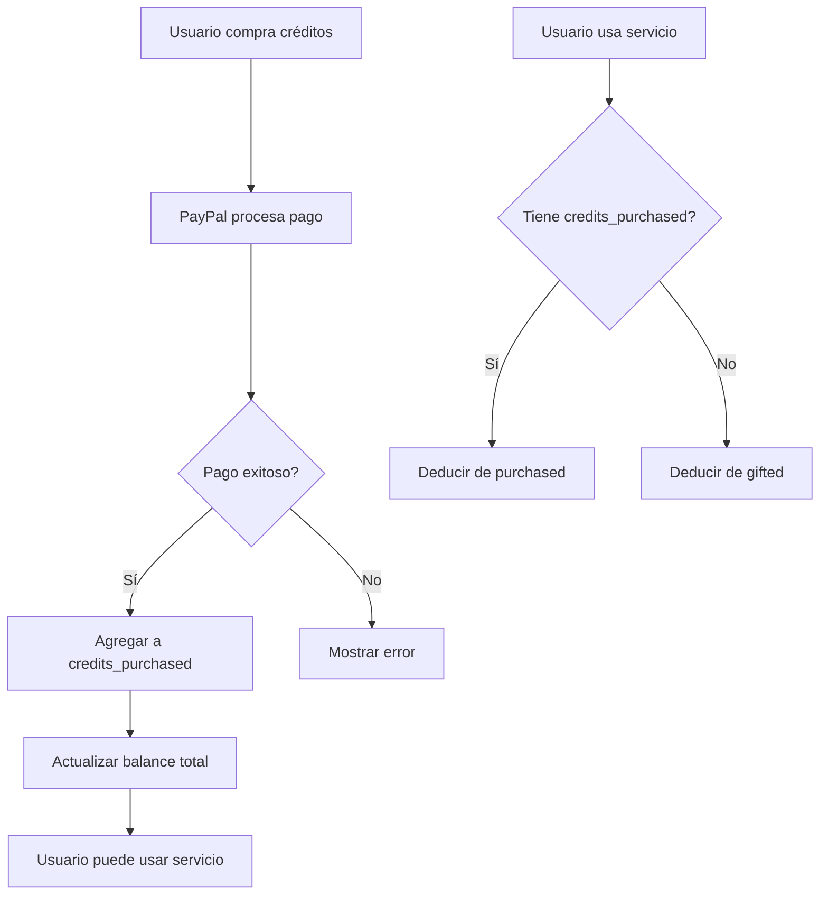

# CRÉDITOS VIRTUALES - POLÍTICA IMPORTANTE

## ⚠️ ADVERTENCIA LEGAL

Los créditos otorgados en TarantulaHawk son **CRÉDITOS VIRTUALES**, NO dinero real.

### Definición

- **Créditos Virtuales**: Moneda interna de la plataforma sin valor monetario externo
- **NO son dinero electrónico**
- **NO son canjeables por efectivo**
- **NO son reembolsables vía PayPal u otro método de pago**

### Diferencia Crítica

```
┌─────────────────────────────────────────────────────────────┐
│ CRÉDITOS INICIALES ($500 USD)                               │
├─────────────────────────────────────────────────────────────┤
│ Tipo:           VIRTUALES - Regalo de bienvenida           │
│ Origen:         Plataforma (no PayPal)                      │
│ Reembolsable:   ❌ NO                                       │
│ Propósito:      Probar el servicio sin costo inicial       │
└─────────────────────────────────────────────────────────────┘

┌─────────────────────────────────────────────────────────────┐
│ CRÉDITOS COMPRADOS (vía PayPal)                             │
├─────────────────────────────────────────────────────────────┤
│ Tipo:           PREPAGO - Compra de servicio               │
│ Origen:         Pago del usuario                            │
│ Reembolsable:   ⚠️ Según política de reembolsos            │
│ Propósito:      Consumo de servicios AML                    │
└─────────────────────────────────────────────────────────────┘
```

## Implementación en Sistema

### Base de Datos

La tabla `profiles` debe distinguir:

```sql
ALTER TABLE profiles ADD COLUMN credits_gifted DECIMAL(10,2) DEFAULT 0;
ALTER TABLE profiles ADD COLUMN credits_purchased DECIMAL(10,2) DEFAULT 0;

-- Calcular balance total
account_balance_usd = credits_gifted + credits_purchased
```

### Orden de Consumo

**Al deducir créditos, consumir primero los COMPRADOS:**

1. Si `credits_purchased > 0` → deducir de ahí
2. Si `credits_purchased = 0` → deducir de `credits_gifted`

**Razón**: Los créditos comprados tienen valor monetario, los regalados no.

### Tabla de Transacciones

```sql
ALTER TABLE transaction_history 
ADD COLUMN credit_source TEXT CHECK (credit_source IN ('gifted', 'purchased', 'mixed'));
```

## PayPal Integration

### ✅ LO QUE SÍ DEBE HACER

```javascript
// PayPal capture - AGREGAR a credits_purchased
const result = await paypal.capture(orderId);
if (result.success) {
  await supabase.rpc('add_credits', {
    user_id: userId,
    amount: result.amount,
    transaction_type: 'credit_purchase', // IMPORTANTE
    description: `PayPal purchase: $${result.amount}`,
    metadata: { 
      paypal_order_id: orderId,
      credit_type: 'purchased' // Marcar como comprado
    }
  });
}
```

### ❌ LO QUE NO DEBE HACER

```javascript
// ❌ NUNCA hacer esto con créditos iniciales
await paypal.refund({
  amount: user.credits_gifted, // ¡ERROR! No tienen valor real
  reason: 'Virtual credits refund'
});
```

## Términos y Condiciones

Agregar a los T&C de la plataforma:

> **4. Créditos Virtuales**
>
> 4.1. Al registrarse, el usuario recibe 500 USD en créditos virtuales de cortesía.
>
> 4.2. Estos créditos NO constituyen dinero electrónico ni tienen valor monetario fuera de la plataforma.
>
> 4.3. Los créditos virtuales de cortesía NO son reembolsables, canjeables ni transferibles.
>
> 4.4. Los créditos comprados mediante PayPal u otro método de pago están sujetos a la política de reembolsos establecida en la sección 7.
>
> 4.5. El usuario acepta que los créditos virtuales son un beneficio promocional sin valor de cambio.

## Política de Reembolsos (Créditos Comprados)

```markdown
### Política de Reembolsos

**Créditos NO utilizados**: Reembolsables dentro de 30 días
**Créditos parcialmente utilizados**: No reembolsables
**Créditos totalmente utilizados**: No reembolsables

Ejemplo:
- Compra: $100 USD → 100 créditos
- Consumo: 30 créditos
- Reembolso máximo: $0 (ya usó parte del servicio)
```

## Dashboard Admin

En el panel de administración, mostrar:

```typescript
interface UserCredits {
  total: number;
  gifted: number;      // Créditos iniciales (no reembolsables)
  purchased: number;   // Créditos comprados (potencialmente reembolsables)
  used: number;        // Total consumido
}
```

## Flujo de Compra Correcto



## Código de Ejemplo

### Función de deducción mejorada

```sql
CREATE OR REPLACE FUNCTION deduct_credits_smart(
  p_user_id UUID,
  p_amount DECIMAL
)
RETURNS TABLE(success BOOLEAN, new_balance DECIMAL, source TEXT)
LANGUAGE plpgsql
AS $$
DECLARE
  v_purchased DECIMAL;
  v_gifted DECIMAL;
  v_from_purchased DECIMAL;
  v_from_gifted DECIMAL;
BEGIN
  SELECT credits_purchased, credits_gifted 
  INTO v_purchased, v_gifted
  FROM profiles 
  WHERE id = p_user_id
  FOR UPDATE;
  
  -- Check total balance
  IF (v_purchased + v_gifted) < p_amount THEN
    RETURN QUERY SELECT false, v_purchased + v_gifted, 'insufficient'::TEXT;
    RETURN;
  END IF;
  
  -- Deduct from purchased first
  v_from_purchased := LEAST(v_purchased, p_amount);
  v_from_gifted := p_amount - v_from_purchased;
  
  UPDATE profiles
  SET credits_purchased = v_purchased - v_from_purchased,
      credits_gifted = v_gifted - v_from_gifted
  WHERE id = p_user_id;
  
  -- Determine source
  IF v_from_purchased > 0 AND v_from_gifted > 0 THEN
    RETURN QUERY SELECT true, (v_purchased - v_from_purchased + v_gifted - v_from_gifted), 'mixed'::TEXT;
  ELSIF v_from_purchased > 0 THEN
    RETURN QUERY SELECT true, (v_purchased - v_from_purchased + v_gifted - v_from_gifted), 'purchased'::TEXT;
  ELSE
    RETURN QUERY SELECT true, (v_purchased - v_from_purchased + v_gifted - v_from_gifted), 'gifted'::TEXT;
  END IF;
END;
$$;
```

## Resumen Ejecutivo

| Aspecto | Créditos Regalados | Créditos Comprados |
|---------|-------------------|-------------------|
| Valor inicial | $500 USD | $0 (hasta que compre) |
| Origen | Plataforma | PayPal del usuario |
| Reembolsable | ❌ NO | ⚠️ Según política |
| Propósito | Prueba gratuita | Uso continuo |
| Prioridad de consumo | Segunda | Primera |
| Contabilidad PayPal | NO incluir | SÍ incluir |

---

**CRÍTICO**: Nunca mezclar créditos virtuales regalados con transacciones de PayPal para evitar:
1. Fraude de reembolsos
2. Problemas contables
3. Disputas legales
4. Violaciones de términos de PayPal
